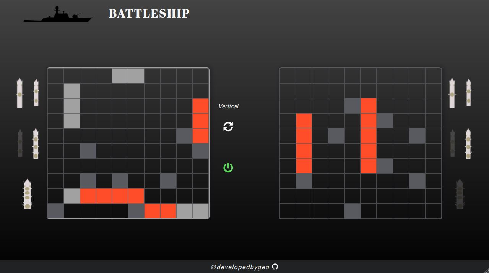

# Battleship



Battleship - the well-known, strategy-type, guessing game that many of us loved to play growing up. It has been built mobile-first, as part of the **Test-Driven Development** section of The Odin Project, with the single player in mind - it is you versus the AI. It is responsive in all viewports and for both portrait and landscape modes.

## Installation

**Installing the dependencies:**

After cloning, it would be essential to install the dependencies:

```
npm install
```

**Building the project:**

Creating the _/dist_ directory requires building:

```
npm run build
```

**Running the project on watch mode:**

`watch` has also been configured and can be run with:

```
npm run watch
```

## Features

- Custom ship placement & rotation.
- Live preview of the placement area.
- Live UI ship updates based on the ship's independent status.

## Tech

- JavaScript
- Lodash
- FontAwesome
- Webpack
- NPM

For a more detailed overview of the development & production dependencies, please check `package.json`.

## Live Version

<https://developedbygeo.github.io/Battleship/>

## Contributing

Contributions are certainly welcome. Please feel free to open an issue/PR if there is something you would like to be changed.

## Acknowledgements

A massive thank you to The Odin Project & freeCodeCamp community, as their guidance and learning process have been invaluable.

## License

[MIT](./LICENSE.md)
